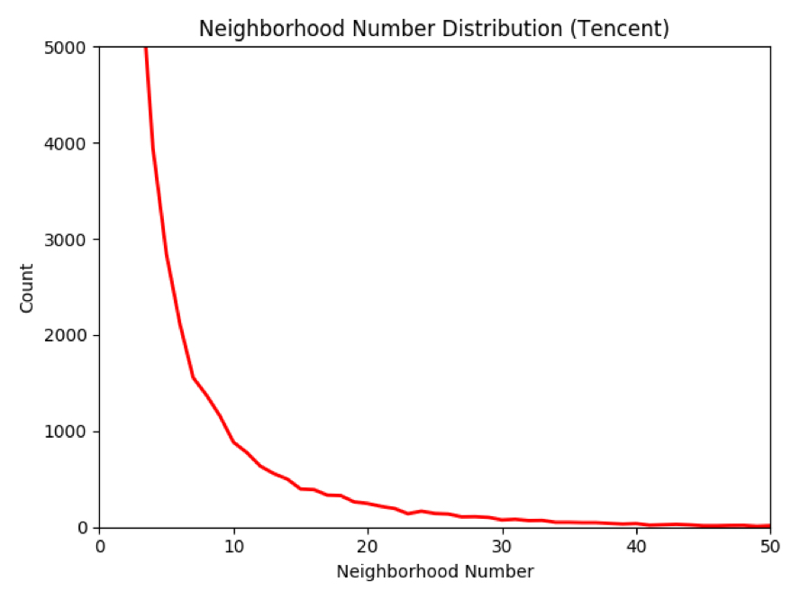
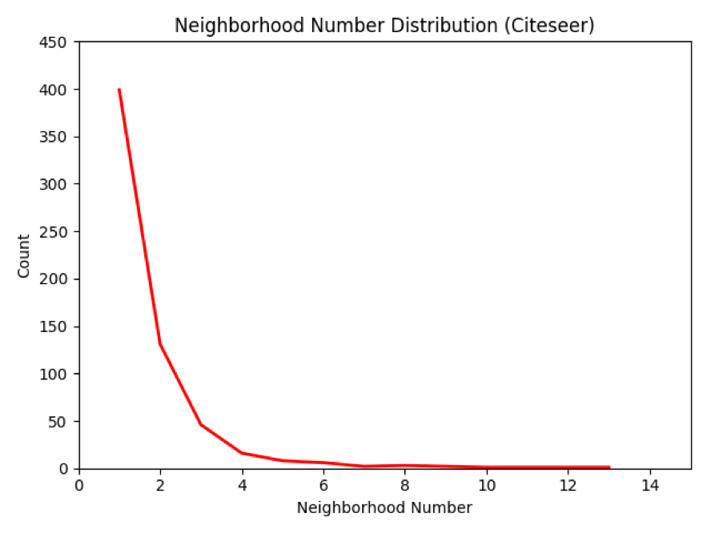
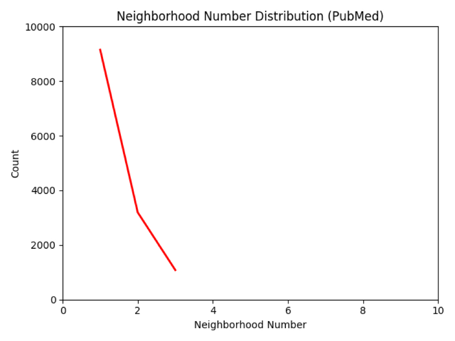

# Adversarial Learning with Graph Convolutional Networks for Unsupervised Bipartite Graph Embedding

## Model Architecture

## Data Set
Tencent:

## Model Performance Comparision (Micro-F1 score)
|                | ABCGraph (Adversarial)     | ABBCGraph (MLP)            | Node2Vec                    | GCN                         | GraphSAGE                   | GAE                         | Pure Node Attribute         |
| :------------- | :----------:               | :----------:               | -----------:                | -----------:                | -----------:                | -----------:                | -----------:                |
| Metrics        | F1-macro / F1-micro        | F1-macro / F1-micro        | F1-macro / F1-micro         | F1-macro / F1-micro         | F1-macro / F1-micro         | F1-macro / F1-micro         | F1-macro / F1-micro         |
| Tencent        | 0.639289 / 0.965502        | Running                    | 0.609956 / 0.967713         | 0.528420 / 0.896612         | 0.579709 / 0.940197         | N/A (*)                     | 0.497346                    |
| Cora           | 0.837969 / 0.863946        | 0.784115 / 0.809524        | 0.780201 / 0.809524         | 0.762734 / 0.782313         | 0.800763 / 0.823129         | 0.754289 / 0.782313         | 0.758143 / 0.789116         |
| Citeseer       | 0.703048 / 0.772358        | 0.676239 / 0.764228        | 0.626968 / 0.723577         | 0.626836 / 0.715447         | 0.665325 / 0.747967         | 0.644748 / 0.731707         | 0.620755 / 0.707317         |
| PubMed         | 0.864784 / 0.862197        | 0.847273 / 0.843203        | 0.839086 / 0.833892         | 0.843036 / 0.838361         | 0.842696 / 0.838361         | 0.828317 / 0.823091         | 0.842813 / 0.838361         |

## Model Training Time Comparision (Seconds)
|                | Tencent                    | Cora                       |     Citeseer               |     PubMed               |
| :------------- | :----------:               | :----------:               | :----------:               | :----------:             |
|                | CPU/GPU                    | CPU/GPU                    |     CPU/GPU                |     CPU/GPU              |
| ABCGraph(Adv)  |                            |                            |
| ABCGraph(MLP)  |                            |                            |
| Node2Vec       |                            |                            |
| GCN            | Infinite / 5200            |                            |
| GraphSAGE      | Infinite / 5200            |                            |
| GAE            | OOM / --                   |                            |

# Reproducibility

## Preparation
~~~
pip3 install -r requirements.txt
~~~

## Peproduciable Scripts Overview
|                | ABCGraph (Adversarial)         | ABCGraph (MLP)                 | Node2Vec                    | GCN                         | GraphSAGE                   | GAE                         |
| :------------- | :----------:                   | :----------:                   | -----------:                | -----------:                | -----------:                | -----------:                |
| Platform       | MacOS/Linux                    | MacOS/Linux                    | Only Linux (*)              | MacOS/Linux                 | MacOS/Linux                 | MacOS/Linux                 |
| Tencent        | sh run_abcgraph_adv.sh tencent | sh run_abcgraph_mlp.sh tencent | sh run_node2vec.sh tencent  | sh run_gcn.sh tencent       | sh run_graphsage.sh tencent | N/A (*)                     |
| Cora           | sh run_abcgraph_adv.sh cora    | sh run_abcgraph_mlp.sh cora    | sh run_node2vec.sh cora     | sh run_gcn.sh cora          | sh run_graphsage.sh cora    | sh run_gae.sh cora          |
| Citeseer       | sh run_abcgraph_adv.sh citeseer| sh run_abcgraph_mlp.sh citeseer| sh run_node2vec.sh citeseer | sh run_gcn.sh citeseer      | sh run_graphsage.sh citeseer| sh run_gae.sh citeseer      |
| PubMed         | sh run_abcgraph_adv.sh pubmed  | sh run_abcgraph_mlp.sh pubmed  | sh run_node2vec.sh pubmed   | sh run_gcn.sh pubmed        | sh run_graphsage.sh pubmed  | sh run_gae.sh pubmed        |

Only Linux (*): For the Node2Vec model, its binary file is only ELF 64-bit LSB executable, x86-64, for GNU/Linux.

N/A (*): For the GAE model, the code of the original GAE paper can not simply applied to the large-scale bipartite graph due to the memory constrain. 
To apply GAE to the large-scale graph data is another research topic, so we don't report the result in the "Tencent" dataset. From the other datasets, we can see that our model's performance is better than the GAE model. 

Background running: 
~~~
# ABCGraph (Adversarial)
nohup sh run_abcgraph_adv.sh tencent > log_run_abcgraph_adv_tencent.txt 2>&1 &
nohup sh run_abcgraph_adv.sh cora > log_run_abcgraph_adv_cora.txt 2>&1 &
nohup sh run_abcgraph_adv.sh citeseer > log_run_abcgraph_adv_citeseer.txt 2>&1 &
nohup sh run_abcgraph_adv.sh pubmed > log_run_abcgraph_adv_pubmed.txt 2>&1 &

# ABCGraph (MLP)
nohup sh run_abcgraph_mlp.sh tencent > log_run_abcgraph_mlp_tencent.txt 2>&1 &
nohup sh run_abcgraph_mlp.sh cora > log_run_abcgraph_mlp_cora.txt 2>&1 &
nohup sh run_abcgraph_mlp.sh citeseer > log_run_abcgraph_mlp_citeseer.txt 2>&1 &
nohup sh run_abcgraph_mlp.sh pubmed > log_run_abcgraph_mlp_pubmed.txt 2>&1 &

# Node2Vec
nohup sh run_node2vec.sh tencent > log_run_node2vec_tencent.txt 2>&1 &
nohup sh run_node2vec.sh cora > log_run_node2vec_cora.txt 2>&1 &
nohup sh run_node2vec.sh citeseer > log_run_node2vec_citeseer.txt 2>&1 &
nohup sh run_node2vec.sh pubmed > log_run_node2vec_pubmed.txt 2>&1 &

# GCN
nohup sh run_gcn.sh tencent > log_run_gcn_tencent.txt 2>&1 &
nohup sh run_gcn.sh cora > log_run_gcn_cora.txt 2>&1 &
nohup sh run_gcn.sh citeseer > log_run_gcn_citeseer.txt 2>&1 &
nohup sh run_gcn.sh pubmed > log_run_gcn_pubmed.txt 2>&1 &

# GraphSAGE
nohup sh run_graphsage.sh tencent > log_run_graphsage_tencent.txt 2>&1 &
nohup sh run_graphsage.sh cora > log_run_graphsage_cora.txt 2>&1 &
nohup sh run_graphsage.sh citeseer > log_run_graphsage_citeseer.txt 2>&1 &
nohup sh run_graphsage.sh pubmed > log_run_graphsage_pubmed.txt 2>&1 &

# GAE
nohup sh run_gae.sh tencent > log_run_gae_tencent.txt 2>&1 &
nohup sh run_gae.sh cora > log_run_gae_cora.txt 2>&1 &
nohup sh run_gae.sh citeseer > log_run_gae_citeseer.txt 2>&1 &
nohup sh run_gae.sh pubmed > log_run_gae_pubmed.txt 2>&1 &

~~~